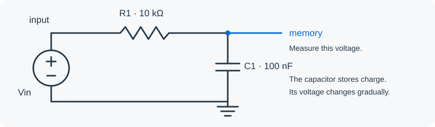
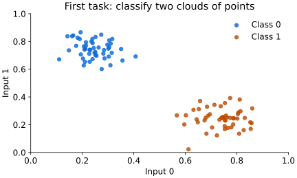
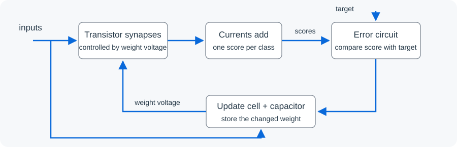
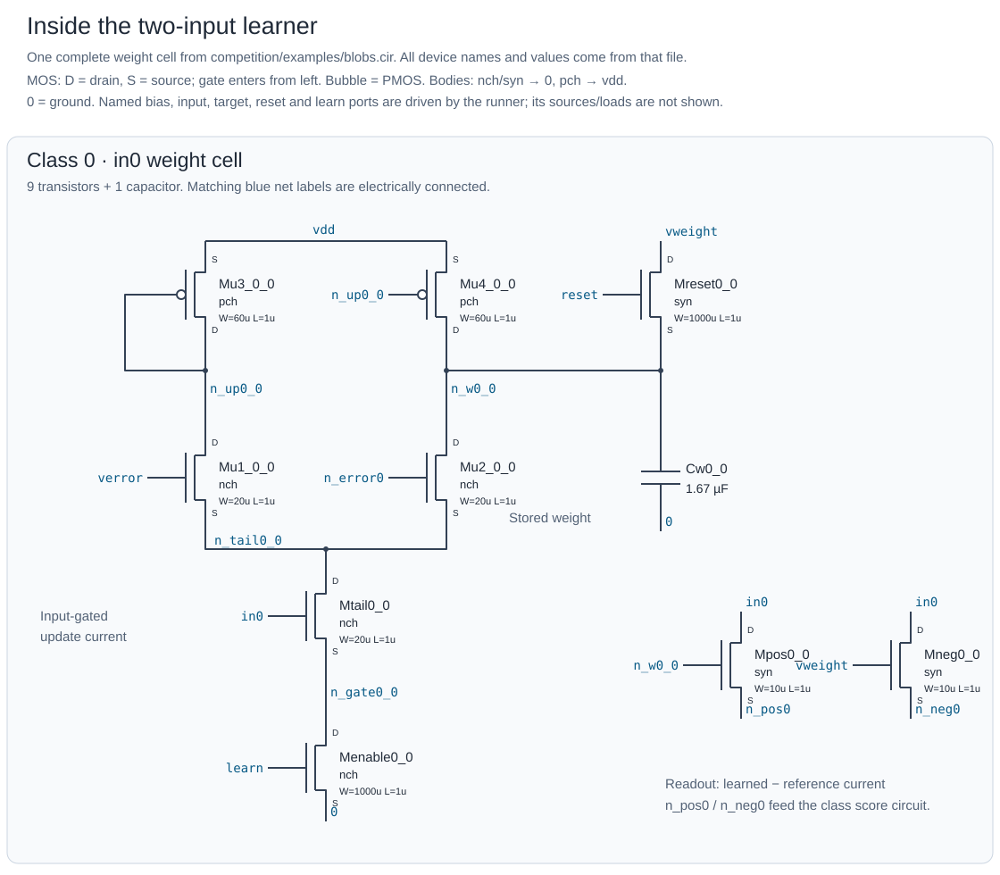
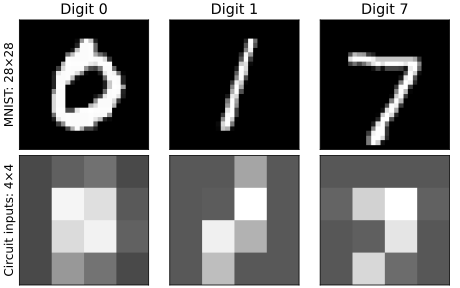

# Can an electrical circuit learn to recognize handwriting?

MNIST is a collection of handwritten digits. Usually, a computer learns to recognize
them by adjusting numbers in a neural network. **Here, we want the electrical circuit
itself to learn.** An image becomes a set of voltages, transistors turn those voltages
into currents, and capacitors store learned weights as electrical charge.

This project teaches analog learning through runnable examples and an open competition:
**design a circuit that learns to classify digits accurately, using little energy.**
You submit the circuit; a Python runner presents the data, simulates it, and measures
its performance. You can do everything in software—no electronics lab is needed.

Why try this? Currents naturally add at a wire junction, and a capacitor can remember
a voltage without repeatedly moving a weight between a processor and memory.
That could make some learning operations efficient. Whether a particular circuit
actually saves energy is something to measure, not assume.

## 1. Meet an analog circuit

A digital signal represents discrete values such as 0 and 1. An analog signal can
represent a value by a continuously varying voltage or current. A dark pixel might
become 0.3 V and a bright one 1.7 V.

Start with something smaller than a neural network: **a resistor charging a capacitor**.



The resistor limits current. The capacitor stores charge, so the voltage at `memory`
changes gradually when the input changes. Its time scale is `R × C`: here, about
1 millisecond. This is one building block of a learned weight. By itself, the circuit
stores a voltage; it is not a classifier.

### Program the connections

A SPICE **netlist** describes which component connects to which wire. These are the
essential lines of [the complete example](circuits/first_capacitor.cir):

```spice
Vin input 0 PULSE(0 1 0 1u 1u 5m 10m)
R1 input memory 10k
C1 memory 0 100n
.tran 10u 4m
```

`Vin` drives a pulse from 0 to 1 volt. `R1` connects `input` to `memory` through
10 kΩ. `C1` connects `memory` to ground (`0`) through 100 nF. Names such as `input`
and `memory` identify wires; using the same name means connecting to the same wire.
`.tran` asks the simulator to follow the circuit over time. The full example also
requests the voltages to be printed and ends the netlist.

For a neural circuit, we add transistors. A MOS transistor uses a voltage on its
**gate** to control current through another connection. A stored weight voltage can
therefore control how strongly an input contributes to a prediction.

### Draw it and watch it work

Open **[Spice Sim in your browser](https://thomasahle.com/spice-sim/)**—no installation needed:

1. Under **Examples → Fundamentals**, click **RC step response**.
2. It selects **Transient** and automatically plots **V(out)**, the capacitor voltage.
3. Change **Stop time** from **10** to **4**, leaving its unit as **ms**, then click **Run**.
4. The voltage should rise from 0 V to about **4.91 V**. Try increasing the resistance
   or capacitance: the voltage should respond more slowly.

The browser example uses 1 kΩ, 1 µF and a 5 V input; our netlist uses 10 kΩ,
100 nF and 1 V. Both have the same **1 ms time constant**. The browser's output
is named `out` instead of `memory`. Its default 10 ms view also shows discharge
after the pulse falls at 5 ms. You can later use **Import netlist** to explore
your own code; imported circuits may need voltage probes or traces selected.

For batch experiments, install [ngspice](https://ngspice.sourceforge.io/download.html)
or an [open source build of Xyce](https://xyce.sandia.gov/downloads/source-code/).
Both solve the circuit's electrical equations over time. Xyce also supports parallel
simulation; whether that is faster depends on the circuit and build.

For ngspice, use `brew install ngspice` on macOS, or
`sudo apt-get install ngspice` on Debian/Ubuntu. Check the installed version with
`ngspice --version`; scores from different simulator versions are not automatically
interchangeable.

Clone the repository before running local commands (Git is required):

```bash
git clone --depth 1 https://github.com/thomasnormal/spicenn2.git
cd spicenn2
```

Now run the complete RC netlist:

```bash
ngspice -b circuits/first_capacitor.cir
# Or:
Xyce circuits/first_capacitor.cir
```

The table contains `time` in seconds and node voltages in volts. Find the
`v(memory)` column: it should be about **0.63 V at 0.001 s** and **0.982 V at
0.004 s**. The simulator prints many intermediate rows. A successful run exits
without errors; these values connect the numerical output to the charging curve.

The browser is useful for exploring small circuits. The Python runner below handles
the repeated data presentation and measurements needed for learning experiments.

## 2. Teach a small circuit first

Before handwriting, try two clouds of points. Each point has just two inputs and
belongs to class 0 or class 1. This deliberately simple problem makes it easier to
see whether the circuit is learning.



The [two-input learning circuit](competition/examples/blobs.cir) has a score for each
class and a capacitor for each trainable weight. Its design comes from this project's
existing multiclass learner, adapted to the submission interface.



It uses an **analog delta rule**, the single-layer relative of gradient descent:

```text
weight change ∝ input × (target − prediction)
```

The transistor update cell approximates this relationship electrically. When a score
is too low or too high, the update current changes the corresponding capacitor voltage.
That voltage changes the next prediction. This baseline has no hidden layer, so it
does not need backpropagation through several layers or an equilibrium-propagation
free/nudged phase pair. The [research archive](docs/README.md) explores those alternatives.

Here is the **actual transistor circuit for one weight cell**, not just a block
diagram. `Cw0_0` stores the weight; `Mreset0_0` initializes it; the `Mu` transistors
charge or discharge it during learning. `Mpos0_0` and `Mneg0_0` read the input as
currents that feed the class score circuit. Matching blue wire labels mean an
electrical connection, even where no wire is drawn between them.



The full two-input learner repeats this cell six times: one per input plus a bias
for each of the two classes. [Open the complete, zoomable circuit schematic](docs/figures/blobs_circuit.svg)
to see all **74 transistors, 6 capacitors, and 4 resistors**, including both score
and error circuits. The runner supplies the external signals and bias voltages.
Both drawings use the device names and values from the
[raw netlist](competition/examples/blobs.cir); regenerate them with
`python competition/draw_blobs.py`.

Here is the corresponding netlist excerpt for the capacitor, reset, and readout:

```spice
* Store the weight and initialize it during reset.
Cw0_0 n_w0_0 0 1.67e-06
Mreset0_0 vweight reset n_w0_0 0 syn W=1000u L=1u
* Read the input using the learned gate voltage.
Mpos0_0 in0 n_w0_0 n_pos0 0 syn W=10u L=1u
Mneg0_0 in0 vweight n_neg0 0 syn W=10u L=1u
```

For a MOS device, the four node names are drain, gate, source, and body; `syn` selects
the supplied transistor model, and `W`/`L` set its width and length. The rest of the
file contains the score and update circuitry. During initialization, a real switch
charges the capacitor from a metered bias source; it does not begin with free stored charge.

How do the `Mu` transistors change a weight? `Mu1` and `Mu2` compare the fixed
`verror` voltage with the class's error voltage. `Mu3`/`Mu4` mirror the first
branch's current into the weight capacitor, while `Mu2` draws current out.
Their difference sets **C × dV(weight)/dt = current in − current out**.
`Mtail` makes the available update current depend on the input, and `Menable`
turns the update off when `learn` is low. A larger error can therefore steer
charge in either direction, with an input-dependent strength. This is an
approximation to input × error, not an exact multiplier: thresholds, saturation
and offsets matter, which is why we test the complete circuit.

### Run the circuit on the dataset

Install Python 3.9+ and ngspice, then set up the runner from the repository
directory you cloned above:

```bash
python3 -m venv .venv
. .venv/bin/activate
python -m pip install -r competition/requirements.txt

python competition/prepare_toy.py /tmp/blobs.npz
python competition/runner.py competition/examples/blobs.cir /tmp/blobs.npz \
  --epochs 10 --startup 0.02 --output /tmp/blobs-score
```

The first argument is **your circuit file**; the second is the dataset. The runner
presents 40 training examples for 10 passes, disables the learning signal, then
presents 100 test examples without labels—all in one continuous simulation. It reads
the output voltages and reports accuracy and energy. Python does not compute or apply
weight updates.

This example scored **100/100 test points** on both ngspice and Xyce, drawing about
**4.81 µJ per test example** with the settings above. Without training (`--epochs 0`),
the symmetric initial outputs tie and count as invalid predictions. These are small
demonstration results, not an estimate of handwriting accuracy.

Try the untrained control explicitly, reusing the same dataset:

```bash
python competition/runner.py competition/examples/blobs.cir /tmp/blobs.npz \
  --epochs 0 --startup 0.02 --output /tmp/blobs-untrained-score
```

Expect **0/100 correct and 100 tied/invalid predictions**, versus 100/100 with
training. That is because identical initialized class scores tie, not because
random guessing in a two-class problem normally scores zero. Compare `correct`,
`invalid_predictions`, and the energy fields in the two `report.json` files.
The runner always exposes ten digit outputs, so even this two-class report has
a 10×11 confusion matrix: rows are true digits, columns 0–9 are predictions,
and the last column counts invalid/tied predictions. Unused classes have zero rows.

To use Xyce, add `--simulator xyce` and choose a new output directory. Its executable
should be named `Xyce` on your PATH, or supplied through `--binary /path/to/Xyce`.
Each run saves a `report.json`, generated test harness, and simulator log. Add
`--keep-trace` to retain a compressed voltage/power trace too. Output directories
must be new so one experiment cannot overwrite another. If simulation fails, the
runner retains the harness, log, failure details, and any partial trace for debugging.

To reproduce the complete ngspice tutorial configuration without remembering its
flags, use `--task blobs-dev` instead of `--epochs 10 --startup 0.02`. Named tasks
check the dataset contents and simulator version too; see the
[task presets](competition/tasks/README.md).

## 3. From two inputs to MNIST

The same idea scales to pixels: one input voltage per pixel, a learned set of weights
for each digit, and one output score per digit. Start with **real MNIST digits 0, 1,
and 7, reduced from 28×28 to 4×4** so the simulation remains approachable.



Open [the MNIST learning circuit](competition/examples/mnist_017.cir). It has 16 pixel
inputs, 3 class scores, and 51 weight capacitors: 16 input weights plus a bias weight
per class. All its trainable weights learn inside SPICE. The small
[circuit generator](competition/make_baseline.py) simply writes repeated connections;
it does not read training data or learn weights in Python.

```bash
python competition/prepare_mnist.py data/mnist-idx /tmp/mnist017.npz \
  --download --labels 0,1,7 --normalize zscore
python competition/runner.py competition/examples/mnist_017.cir /tmp/mnist017.npz \
  --epochs 20 --startup 0.02 --output /tmp/mnist017-score
```

Preparation downloads and checks the original MNIST archives, keeps the official
training and test splits separate, then selects 24 training and 50 test images per
class. Each 7×7 block becomes one pixel; per-image contrast normalization then maps
the 16 values into the input-voltage range.

With the command above, the circuit scored **66% (99/150 test images)** in ngspice 46,
using about **10.72 µJ per test image**. Chance is 33.3%. This is a **three-digit, 4×4
baseline**, not the full ten-digit, 28×28 task. See [the run record](docs/TUTORIAL_RESULTS.md)
for settings, energy breakdowns, simulator versions, and limitations.

Allow a few minutes of wall-clock time: recent starter runs took roughly 90–130
seconds on one CPU, despite simulating only 1.61 seconds. The terminal can stay
quiet between the initial schedule and final score. In a second terminal,
`tail -f /tmp/mnist017-score/simulator.log` shows simulator progress; press Ctrl+C
there to stop watching, not in the terminal running the benchmark. Reuse the
prepared dataset for experiments, but always choose a new output directory.

### A component value is also a learning parameter

For a capacitor, `dV/dt = I/C`: a larger weight capacitor changes voltage more slowly
under the same update current. The learning timescale matters. Keeping this circuit
unchanged except for increasing its weight capacitors from **1.67 µF to 16 µF**
gave **89.33% (134/150)** at **9.86249 µJ/image** on the same public development set.
The [tuned example](competition/examples/mnist_017_tuned.cir) is included:

```bash
python competition/runner.py competition/examples/mnist_017_tuned.cir /tmp/mnist017.npz \
  --epochs 20 --startup 0.02 --output /tmp/mnist017-tuned-score
```

This capacitance was chosen after inspecting development scores, so this is a
tuning result, not performance on an untouched final test set. The circuit still
learns its weights during the run; choosing its capacitance is an offline design
decision. Larger capacitors also cost startup energy and physical area. You can
export other values with `make_baseline.py --capacitance <farads>`.

For this MNIST configuration, `--task mnist017-v0` replaces
`--epochs 20 --startup 0.02` and rejects accidentally mismatched data or settings.

### All ten digits: the main track

The [ten-digit circuit](competition/examples/mnist_10.cir) repeats the same cells
for all ten classes: 170 weight capacitors and 1,630 transistors. Run it with:

```bash
python competition/prepare_mnist.py data/mnist-idx /tmp/mnist10.npz \
  --download --labels 0,1,2,3,4,5,6,7,8,9 --normalize zscore
python competition/runner.py competition/examples/mnist_10.cir /tmp/mnist10.npz \
  --task mnist10-v0 --output /tmp/mnist10-score
```

This uses 240 training images, 20 training passes, and 500 evaluation images:
5.32 simulated seconds, which can take tens of minutes on a CPU. Adding outputs
does not guarantee good accuracy, especially at 4×4 resolution. See the
[separate leaderboard tables](competition/LEADERBOARD.md) for measured results;
the 0/1/7 tutorial's 89.33% must not be read as ten-digit accuracy.
The untuned ten-digit circuit scores only **18.6% (93/500)** at **27.09 µJ/image**
in the reference run. It is a runnable starting point with substantial room for
improvement, not a competitive handwriting recognizer.
For context, a [software logistic-regression reference](docs/SOFTWARE_REFERENCE.md)
trained on the exact same 240 images and 16 features scores **65.6% (328/500)**,
with fixed parameters and no test-label tuning. That is a Python classifier,
not an eligible circuit submission; its energy was not measured.

Allow time for numerical verification too: v0 gives **each** reference and
half-step simulator run a [30-minute budget](competition/RULES.md#verification-and-failures).
The ten-digit baseline's half-step run took about 29 minutes on the organizer's
host. Larger circuits may exceed the limit; faster local hardware does not change
the organizer's budget.

For architectures beyond this linear learner, explore the
[historical submissions](submissions/HISTORICAL.md): trained-hidden backprop,
physical random features, and predictive coding with a frozen-hidden control.
Their old research results and new competition measurements are kept separate.

## 4. Enter the competition

The goal is to learn MNIST accurately with low electrical energy. The
[v0 rules](competition/RULES.md) define a ten-digit main track and a faster 0/1/7
starter track, with separate [leaderboards](competition/LEADERBOARD.md). This is a
rolling benchmark with no closing date. Evaluation data is public, so these are
development-set results, not claims about a secret final test set.

Want to check a published score first? Follow the
[reproduction walkthrough](competition/REPRODUCE.md): it pins the original v0
runner, loads the published image, and checks your reports without adding an entry.

1. Start from [an example circuit](competition/examples/) and change the connections
   or component values. The current format accepts resistors, capacitors, diodes and
   MOS transistors using the provided device models.
   `python competition/new_submission.py my-design --author "Your Name"` creates
   a ready-to-edit folder with the tuned MNIST circuit, README, and MIT license.
   Add `--baseline mnist_10` to start from the ten-digit circuit instead.
2. Run it locally with `competition/runner.py`. The runner supplies the image, training
   label, power/bias voltages, reset, and timing. Your circuit supplies the class scores.
3. Open a pull request adding `submissions/<name>/circuit.cir` and a short README with
   your learning algorithm, exact run command, data configuration, and local results.
   Include attribution and the MIT license. Run
   `python competition/validate.py submissions/my-design` before opening the PR.
   See [submission instructions](submissions/README.md) and the
   [complete example directory](submissions/example-delta-rule/).
4. The organizer reruns the circuit in the reference container using your named
   task, then checks that predictions and energy are stable at half the timestep.
   Comparisons must
   use the same dataset, labels, preprocessing, training budget, timing, models,
   and simulator version.

### What gets measured?

| Measurement | Meaning |
| --- | --- |
| Accuracy | Fraction of test examples correct; highest output voltage wins |
| Inference energy | Joules supplied to the circuit per test example |
| Training energy | Total joules supplied while the circuit learns |
| Startup energy | Energy used to establish voltages and initialize stored state |
| Latency | Simulated time allowed per example; default 1 ms |

Energy is the integral of supplied power, `voltage × current`, over time. We meter
**every driven pin**, including image, label, clock and bias pins: counting only the
main supply would miss circuits powered through their inputs. Returned energy is
reported separately and does not cancel energy drawn elsewhere.

Accuracy and energy are separate objectives: always guessing one digit is cheap but
not useful. We mark the **Pareto frontier**: entries for which no other circuit has
at least as much accuracy and no more inference energy, with a strict improvement
in one. Training and latency budgets are fixed, and startup/training energy stays
visible. There is no weighted sum that hides this tradeoff.
See [the runner specification](competition/README.md) for the exact interface and measurements.

These are **simulated circuit energy** figures, not the computer's electricity use.
The current transistor models are simplified, and ideal input drivers and output
readout exclude realistic DAC/ADC/controller losses. Treat the numbers as a reproducible
circuit-model benchmark, not fabricated-chip efficiency.

## Explore the research

The [research guide](docs/README.md) links earlier findings, figures, and the experiment
ledger. [pc_deep.py](pc_deep.py) generates a different family of deep predictive-coding
circuits; it is a research program, not the submission runner. Historical scripts live
in [experiments/](experiments/README.md), reference circuits in [circuits/](circuits/README.md),
and manuscript sources in [paper/](paper/). Generated output and datasets are
[kept out of Git](docs/REPOSITORY_HYGIENE.md).

## License

The project's original code, circuit examples, and documentation are available
under the [MIT License](LICENSE). Preserve attribution when adapting an example.
Third-party materials and downloaded datasets retain their own terms; the project
license does not relicense them. See [submission instructions](submissions/README.md)
for how to license a contribution.
